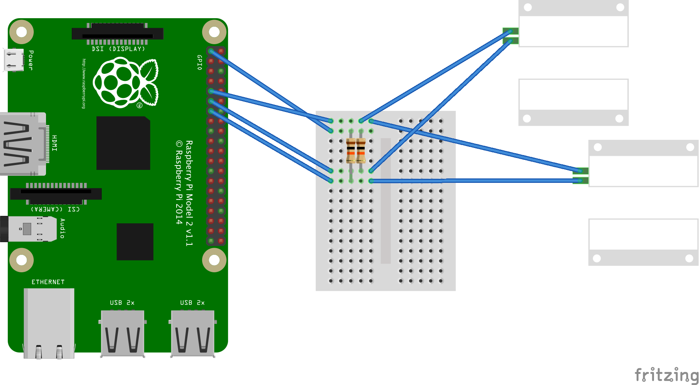

# rpi-door

Raspberry Pi integration with a garage door through two sensors for determining fully opened and fully closed and with a relay to trigger the door.

 
Fritzing diagram: [wiring.fzz](wiring.fzz)

The [magnetic door switches](https://amzn.com/B00PZMG980) are using pull up resistors because I couldn't get the internal pull-ups to work with `raspi-io` even though it should support them.
